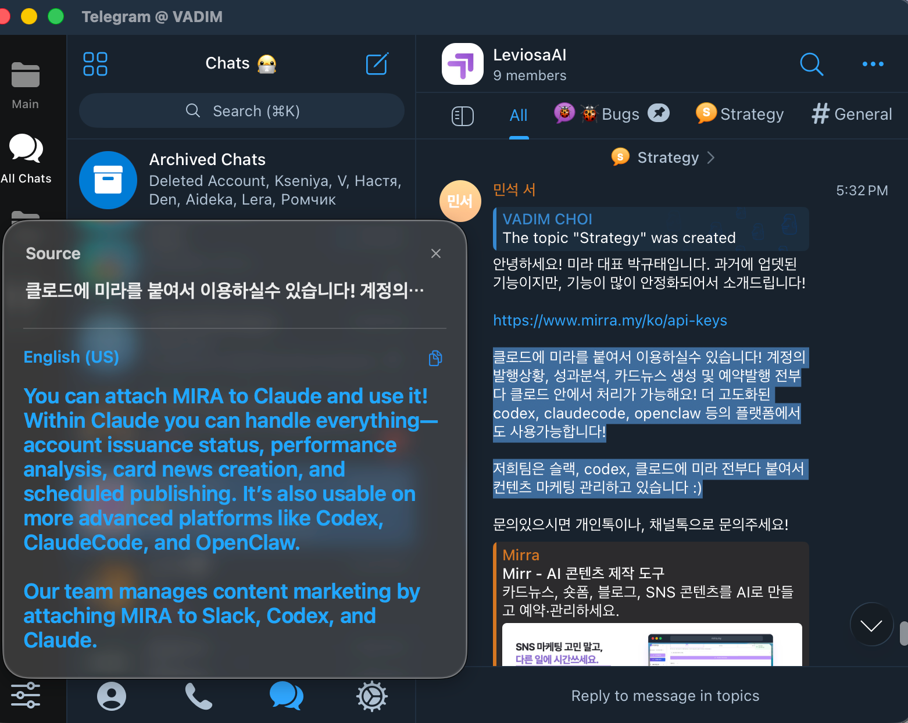
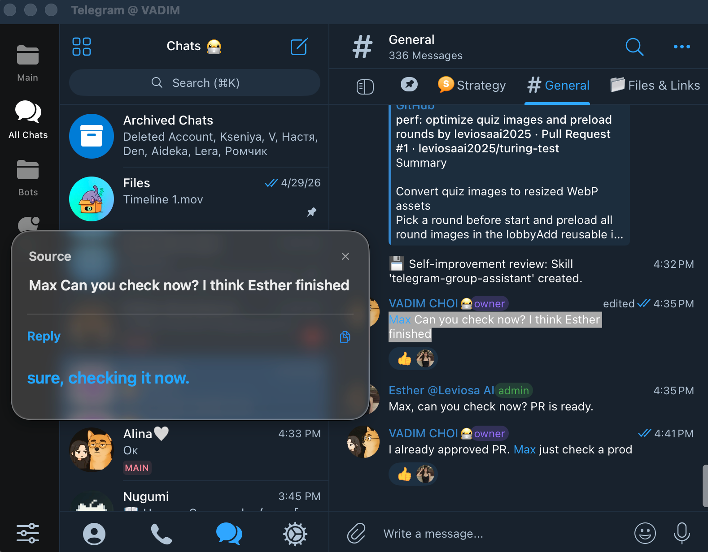
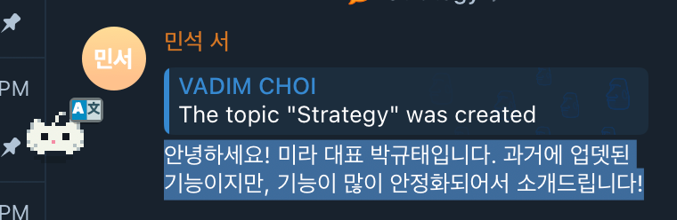

# Nugumi

**Highlight any text on your Mac. See it translated. Right where you are.**

 

  

 

## What is Nugumi?

Nugumi is a friendly translator that lives in your Mac's menu bar. Select any text in any app — a chat message, a webpage, a PDF, a Notion doc — and Nugumi shows you the translation right next to your cursor. No copy-paste. No tab switching. No sending your text to the cloud.

It also drafts smart replies for messages you receive, and reads text out of any area of your screen.

Translation runs on [Ollama](https://ollama.com) — a free helper that runs AI models locally on your Mac. **Nothing you read or write ever leaves your computer.**

## How it works

1. **Highlight** any text in any app.
2. A tiny Nugumi button appears next to your selection.
3. **Click it** — or press <kbd>⌃</kbd> <kbd>1</kbd> — and the translation pops up in place.

That's it.

## Features

### Translate what you select

Highlight a foreign-language message and read it in your language a moment later. Works in Telegram, Slack, Safari, Notes, VS Code, Discord, Mail — anywhere macOS lets you select text.

### Reply in your voice

Got a message in a language you don't speak? Select it and Nugumi suggests a natural reply written _in your_ language. Edit it, then paste.

### A tiny companion, not a popup factory

Nugumi shows up as a small mascot next to your selection — present when you need it, invisible when you don't. Pick the style you like from the menu.

## Install

1. Click the **Download** button above (or grab `Nugumi-X.Y.Z.dmg` from the [latest release](https://github.com/ChoiVadim/nugumi/releases/latest)).
2. Open the DMG and drag **Nugumi.app** to your **Applications** folder.
3. Launch Nugumi from Applications or Spotlight.

On first launch, Nugumi opens a small welcome window asking for two permissions:

| Permission           | What it's for                                 |
| -------------------- | --------------------------------------------- |
| **Accessibility**    | Reading the text you select in other apps.    |
| **Screen Recording** | Translating text in screen areas you capture. |

Click **Open settings** next to each row, flip the toggle for Nugumi, and the welcome window closes automatically when both are granted. Nugumi only ever sees what you actively select or capture — nothing else.

## Updates

Nugumi updates itself. When a new version ships, click **Check for Updates...** in the menu bar to install it in one tap. The updater is signed end-to-end (Apple notarization + EdDSA), so you can trust every patch you get.

## Requirements

- macOS 14 (Sonoma) or later — Apple Silicon and Intel both supported.
- [Ollama](https://ollama.com) installed. Nugumi walks you through it on first launch.

 

Made with 🩷 in Seoul.

